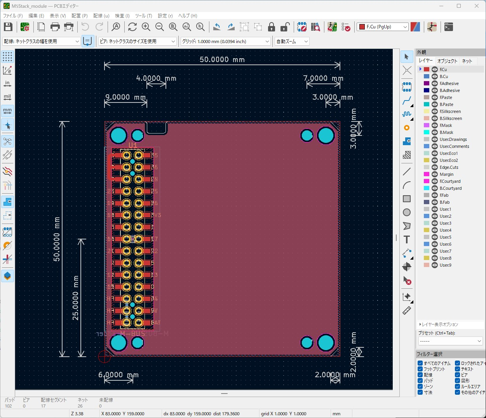

# KiCad6-Environment
My symbols, my footprints, my templates, etc. of KiCad6  
KiCad6 による基板の設計時に作成したライブラリやテンプレートを置いています。
## 1．symbols
「シンボルエディター」で作成したシンボルのライブラリです。
### (1) @bf.kicad_sym
使用しているシンボルのうち、独自に作成したシンボルの全てを含みます。
## 2．footprints
「フットプリントエディター」で作成したフットプリントのライブラリです。
### (1) @bf.pretty
使用しているフットプリントのうち、独自に作成したフットプリントの全てを含みます。
## 3．template
「KiCadマネージャー」において「テンプレートから新規プロジェクトを作成..」で選択可能となる「ユーザーテンプレート」のデータです。
### (1) M5Stack_module
M5Stack用のモジュール基板のテンプレートです。M-BUSのピンヘッダーとピンソケットの両方を備え、モジュールの積み重ねに対応します。フレームにはM5Stack社のPROTOモジュールのモールドを流用することを想定しています。
- 基板の厚さは1mmです

### (2) M5Stack_module_fdm
M5Stack用のモジュール基板のテンプレートです。M-BUSのピンヘッダーとピンソケットの両方を備え、モジュールの積み重ねに対応します。フレームにはFDMによるモールドを使用することを想定し、四隅に逃げがあります。
- 基板の厚さは1mmです
- FDM: Fused Deposition Modeling

### (3) M5Stack_bottom_fdm
M5Stack用のボトム基板のテンプレートです。M-BUSのピンヘッダーがありますがピンソケットはありません。フレームにはFDMによるモールドを使用することを想定し、四隅に逃げがあります。
- FDM: Fused Deposition Modeling

